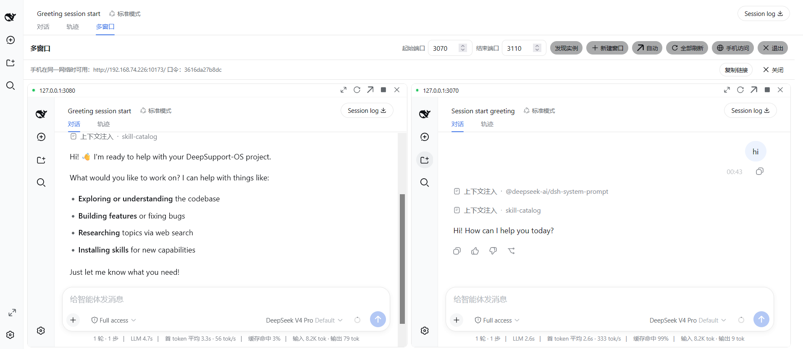
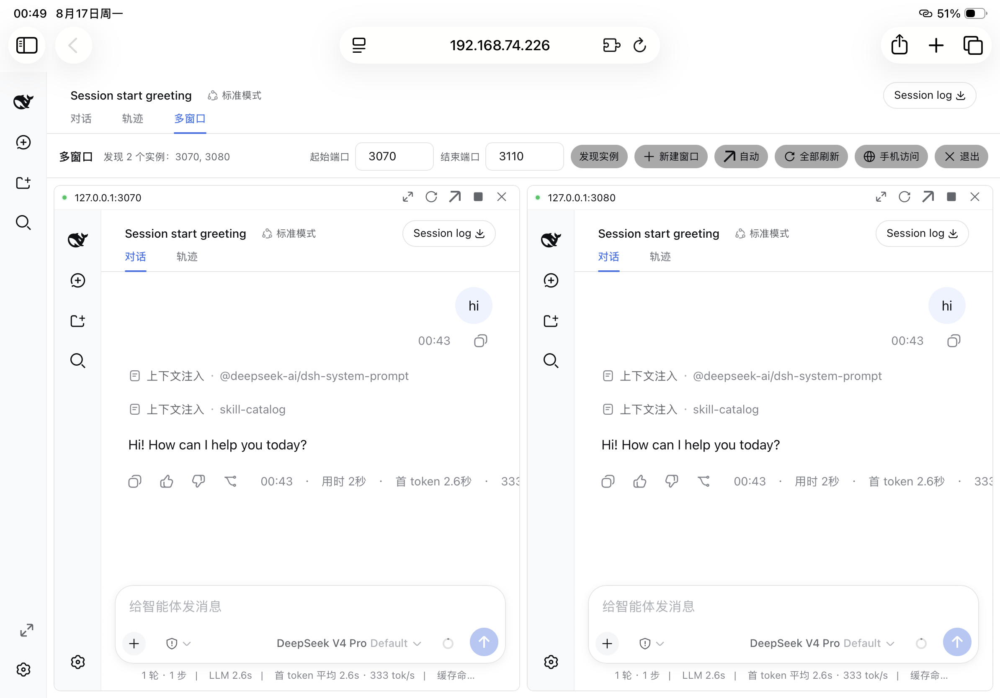
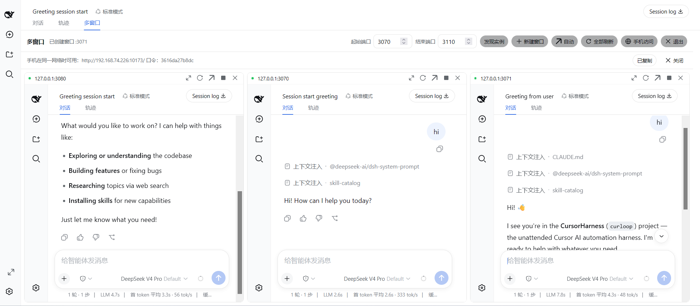

# 💬 dsh-multi-chat — Multi-chat, one screen

**English** | [中文](README.zh.md)

<p align="center">
  <a href="https://www.npmjs.com/package/dsh-multi-chat"></a>
  <a href="https://www.npmjs.com/package/dsh-multi-chat"></a>
  <a href="https://github.com/daetz-coder/dsh-multi-chat/blob/main/LICENSE"></a>
  <a href="https://github.com/topics/dsh-plugin"></a>
</p>

<p align="center">
  <a href="https://awesome-dsh-plugin.com/p/daetz-coder/dsh-multi-chat/"></a>
  <a href="https://dshfind.com/plugins/daetz-coder/dsh-multi-chat"></a>
  <a href="https://github.com/awesome-dsh-plugin/awesome-dsh-plugin"></a>
</p>

> **Run N conversations in DeepSeek Harness at once, watch every Agent's live progress side-by-side, and check in from your phone or tablet.** One browser tab goes from "one conversation at a time" to "a panoramic multi-conversation cockpit."

Install a **multi-window wall** into the official [DeepSeek Harness (DSH)](https://github.com/deepseek-ai/deepseek-harness) Web UI: a grid that shows N running DSH conversation instances simultaneously (each instance runs its own task), so every Agent's live progress, chat, and output are **visible at a glance** — no more hopping between endless tabs and windows.

## ✨ What it does

| Capability | Description |
|------------|-------------|
| 📺 **Multi-window** | One-click entry from the sidebar; the chat area becomes a window grid showing every task side-by-side, one pane per port |
| 🔍 **Auto-discovery** | Scans a port range to auto-find running DSH instances; manual management is also supported |
| ➕ **One-click new window** | Launch a brand-new DSH instance right inside the wall to grow your conversation matrix |
| 📱 **Phone access** | The "Phone access" button starts a **built-in authenticated LAN gateway** — open the URL on your phone, enter the token, and watch progress |
| 🛑 **Window controls** | Maximize, refresh, open in a new tab, stop an instance, and switch column count (auto/1/2/3/4/6) |

> **Multi-chat = multi-port.** Start N `dsh web --port <n>` instances (each running one conversation/task), open the wall from any of them, and you see all of them side-by-side.

## 📸 Screenshots

**🖥️ Windows · Two chats side-by-side** — two running DSH instances laid out together, each pane a full official conversation UI with live online status dots and per-window controls (maximize / refresh / new tab / remove):



**📱 iPad · Two chats on mobile** — on the same LAN, open the token-authenticated gateway URL on an iPad to watch two Agents' live progress on one tablet screen:



**🖥️ Windows · Three-chat panorama** — a 3-column grid of three running instances, all Agents on one screen, upgrading you from "one conversation at a time" to "a panoramic multi-conversation cockpit":



## 🚀 30-second quick start

```bash
# 1. Install (npm / npx, no manual patch needed)
npx dsh-multi-chat install

# 2. Start a few instances
npx dsh-multi-chat start --ports 3080,3081,3082

# 3. Open any instance and click "Multi-window" in the sidebar footer → done 🎉
```

## Why this approach

- **No official logic is touched**: the plugin only registers two **additive list slots** (`conversation.view` ring entry, `sidebar.footer.action` sidebar shortcut) and five read-only JSON routes (`/multi/api/ports`, `/multi/api/status`, `/multi/api/stop`, `/multi/api/create`, `/multi/api/link`). No existing slot is replaced, no line is rewritten, and no core session/agent/tool logic is touched.
- **The UI is the official UI**: the wall is a view in the official view ring rendered inside the chat panel (not a popup). Theme, type scale, icons, and controls all use the official `--dsw-*` tokens and official primitives (Button/Input/Menu/StateDot).
- **Recursion guard**: the wall never embeds its own port; embedded pages carry a `?multi-wall=embed` flag and register no wall UI, preventing infinite "wall-in-wall" recursion.
- **Minimal footprint**: one declarative client plugin package — it ships its own `dsh.bundle.patch` + `cordis.patch.yml`, so DSH mounts it as a bundle layer automatically.

## Directory layout

```
dsh-multi-chat/                    # single-package structure
  lib/                             # built artifacts (lib/index.js + lib/client.js + types)
  src/                             # source (node half + browser half)
  bin/dsh-multi-chat.mjs           # cross-platform npx CLI (install/start/stop/gateway)
  scripts/
    install-plugin.ps1             # pack + install into profile (DSH auto-mounts the bundle)
    start-multi.ps1 / stop-multi.ps1 # start/stop multiple dsh web instances
    gateway.mjs                    # token-authenticated reverse-proxy gateway (phone/remote)
  cordis.patch.yml                 # DSH bundle layer declaration
  harness-src/                     # official deepseek-harness source (dev/build reference)
```

## Install & enable (Windows)

```powershell
# 1) Pack and install into the web profile. The plugin declares dsh.bundle.patch,
#    so DSH auto-mounts its bundle layer — no manual patch edit.
.\scripts\install-plugin.ps1

# 2) Restart dsh web and open any instance
dsh web --port 3084
# Browser: http://127.0.0.1:3084 — a "Multi-window" button appears in the sidebar footer
```

Or manual:

```bash
npm pack                                                  # produce a tarball (dsh-multi-chat-1.0.0.tgz)
dsh plugin --profile web add dsh-multi-chat-1.0.0.tgz     # DSH adds the package to the bundle layer stack automatically
```

Uninstall (one command, nothing manual to clean up):

```bash
dsh plugin --profile web remove dsh-multi-chat
```

## Usage

1. Start several instances: `.\scripts\start-multi.ps1 -Ports "3080,3081,3082,3084"` (or manual `dsh web --port <n>`).
2. Open any instance and click the "Multi-window" shortcut in the sidebar footer (or the "Multi-window" tab at the top of the chat area).
3. Inside the wall view: auto-discovery (own port excluded), column switching (auto/1/2/3/4/6, horizontally filled by default), click title to maximize, ⟳ refresh one, ↗ open in a new tab, ✕ remove from view, refresh all, and live online status dots. The layout is persisted to `localStorage`.
4. To exit the wall, click the **"Exit" button in the toolbar's top-right** to switch back to the chat view in one click.

## Phone / remote access (built-in authenticated gateway)

The official `dsh web` **deliberately forbids `--host 0.0.0.0`** (it would expose remote code execution to the network). This plugin ships a built-in **token-authenticated intranet gateway**: click the "Phone access" button and it **automatically** starts a gateway for the current instance (listening on `0.0.0.0`, reverse-proxying to `127.0.0.1:<this instance's port>`), returning a LAN URL + login token.

```text
Click "Phone access" → you get:
  Available on your phone on the same network: http://10.105.7.204:9477  token: 2efb23eade16
```

Open that URL on your phone and enter the token to reach the full DSH UI. The gateway's security model:

- HMAC-signed HttpOnly/SameSite session cookie (12h default), `?token=` for script convenience, per-IP rate limiting on failed logins
- All proxied requests rewrite Host/Origin to the loopback target, so the official `/api` browser-trust fence (the DNS-rebinding defense) treats it as a local request — no restart / `--trusted-host` needed
- WebSocket upgrades and SSE streams pass through unchanged
- When the intended port hits a Windows excluded range or is already bound, it automatically falls back to an OS-assigned free port

> A standalone `scripts/gateway.mjs` (with optional TLS) is also available for advanced manual use.

## Distribution & install

The repo bundles a cross-platform CLI, `dsh-multi-chat` (`bin/dsh-multi-chat.mjs`), installable through any of the three channels below. Its `install` command probes `$DSH_HOME` (default `~/.dsh`) and idempotently appends the enable patch (same behavior as `install-plugin.ps1`).

### Channel 1: npm / npx (recommended, easiest)

```bash
# After publishing to npm, one line installs on any machine
npx dsh-multi-chat install

# Or run a single command straight from npx (no install needed)
npx dsh-multi-chat start --remote --token <token> --ports 3080,3081
npx dsh-multi-chat gateway --target 127.0.0.1:3080 --token <token>
```

Publishing (maintainer): `npm publish` (unscoped public package `dsh-multi-chat`).

### Channel 2: GitHub Release

Download the source zip/tarball from [Releases](https://github.com/daetz-coder/dsh-multi-chat/releases), unpack it, and cd in:

```bash
node bin/dsh-multi-chat.mjs install           # pack + dsh plugin add + append enable patch
node bin/dsh-multi-chat.mjs start --ports 3080,3081
```

> Tagging a release makes GitHub auto-generate the source zip/tarball assets; you can also attach a `npm pack`-produced `.tgz` as an offline install bundle.

### Channel 3: direct git install

```bash
git clone https://github.com/daetz-coder/dsh-multi-chat.git
cd dsh-multi-chat

node bin/dsh-multi-chat.mjs install           # install the plugin
node bin/dsh-multi-chat.mjs start --ports 3080,3081
node bin/dsh-multi-chat.mjs gateway --target 127.0.0.1:3080 --token <token>
```

### Running straight from this repo (development)

```bash
node bin/dsh-multi-chat.mjs install
node bin/dsh-multi-chat.mjs start --ports 3080,3081
node bin/dsh-multi-chat.mjs stop
node bin/dsh-multi-chat.mjs gateway --target 127.0.0.1:3080 --token <token>
```

## 🔍 Discovery & ecosystem

This plugin follows the official [DeepSeek Harness](https://github.com/deepseek-ai/deepseek-harness) client plugin spec:

- **Be found in the GitHub plugin ecosystem**: adding the [`dsh-plugin`](https://github.com/topics/dsh-plugin) topic to this repo makes it searchable on the official [`dsh-plugin` topic page](https://github.com/topics/dsh-plugin) (the officially recommended third-party discovery path).
- **Bilingual technical docs**: this repo ships `README.md` (English) and `README.zh.md` (Chinese) at the root, matching the bilingual convention of official `packages/client/*` plugins.
- **Purely additive, no core touching**: registers only the `conversation.view` / `sidebar.footer.action` list slots + `/multi/api/*` read-only routes, changing no official core logic.

## Building from source

The single-package layout uses `tsdown` for bundling and `tsc` for type declarations:

```bash
npm install
npm run build          # tsc + tsdown → lib/
npm test               # vitest (browser half in jsdom + node half)
```

## Testing

The unit suite (`tests/browser-plugin.client.spec.tsx`, 20 specs) exercises the
browser half (view-ring entry, sidebar shortcut, wall store, recursion guard,
HMR disposal) against a real cordis Context in jsdom, plus the node half
(probe routes, config schema, stop semantics).

The specs import `@deepseek-ai/*` platform packages whose published versions
lag the snapshot this plugin was written against, so tests resolve them to the
**vendored harness sources** in `harness-src/` instead of npm:

1. First install the vendored workspace once (it is a full DSH checkout):
   ```bash
   cd harness-src && pnpm install && cd ..
   ```
2. `tsconfig.vitest.json` carries the workspace's `tsconfig.base.json` paths
   map (rewritten with a `harness-src/` prefix) so every `@deepseek-ai/*`
   import resolves to sources — never to unbuilt `lib/` outputs. Regenerate it
   after updating the vendored checkout:
   ```bash
   node scripts/sync-vitest-paths.mjs
   ```
3. `vitest.config.ts` feeds that map to `vite-tsconfig-paths` and dedupes
   `react`/`react-dom` so the component specs and `@testing-library/react`
   share one React instance. Then:

   ```bash
   npm test
   ```

> `npm run build`'s `tsc` step resolves `@deepseek-ai/*` types from the
> installed workspace (or from npm-installed versions on a machine with the
> matching snapshot); the committed `lib/` is the reference output.

## License

MIT
