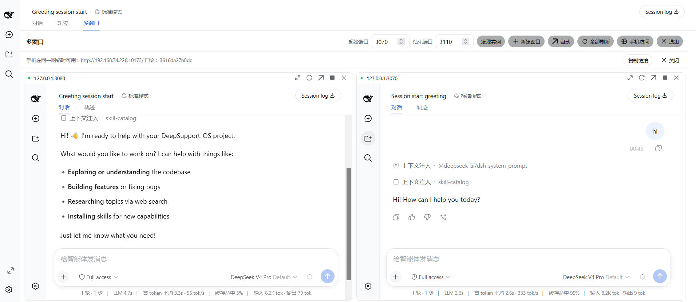
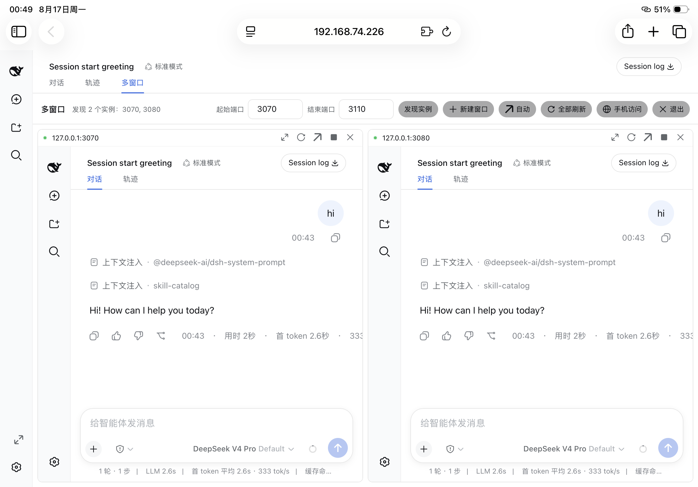
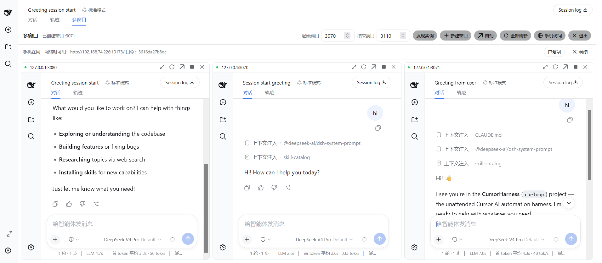

# 💬 dsh-multi-chat —— 多对话，一屏驾驭

[English](README.md) | **中文**

<p align="center">
  <a href="https://www.npmjs.com/package/dsh-multi-chat"></a>
  <a href="https://www.npmjs.com/package/dsh-multi-chat"></a>
  <a href="https://github.com/daetz-coder/dsh-multi-chat/blob/main/LICENSE"></a>
  <a href="https://github.com/topics/dsh-plugin"></a>
</p>

<p align="center">
  <a href="https://awesome-dsh-plugin.com/p/daetz-coder/dsh-multi-chat/"></a>
  <a href="https://dshfind.com/plugins/daetz-coder/dsh-multi-chat"></a>
  <a href="https://github.com/awesome-dsh-plugin/awesome-dsh-plugin"></a>
</p>

> **在 DeepSeek Harness 里同时开 N 个对话，并排盯住每一个 Agent 的实时进度，还能用手机/平板躺着看。** 一个浏览器，从「一次一个对话」升级成「全景多对话驾驶舱」。

给 [DeepSeek Harness (DSH)](https://github.com/deepseek-ai/deepseek-harness) 官方 Web 界面装上一面**多窗口墙**：在一张网格里同时显示 N 个正在运行的 DSH 对话实例（每个实例独立跑一个任务），所有 Agent 的实时进度、对话、输出**一眼尽收**，不用在无数标签页/窗口之间切来切去。

## ✨ 它能做什么

| 能力 | 说明 |
|------|------|
| 📺 **多窗口** | 侧边栏一键进入，右侧对话区原位变成窗口网格，一个端口一格，并排看全部任务 |
| 🔍 **自动发现** | 扫描端口区间自动发现正在运行的 DSH 实例，也可手动管理 |
| ➕ **一键新建窗口** | 墙内直接启动全新 DSH 实例，凑成你的多对话矩阵 |
| 📱 **手机访问** | 点「手机访问」自动起一个**内置带口令认证的局域网网关**，手机打开 URL、输入口令即可看进度 |
| 🛑 **窗口控制** | 单窗口放大、刷新、新标签页打开、关闭实例、列数切换（自动/1/2/3/4/6）|

> **多对话 = 多端口。** 启动 N 个 `dsh web --port <n>`，每个实例独立跑一个对话/任务；在任意一个实例里打开多窗口墙，即可并排看到全部。

## 📸 运行效果

**🖥️ Windows · 双对话并排** —— 两个正在运行的 DSH 实例并排列出，每格都是完整的官方对话界面，带实时在线状态点与单窗控制（放大 / 刷新 / 新标签页 / 移除）：



**📱 iPad · 双对话移动端** —— 同一局域网内，iPad 打开带口令认证的网关地址，即可在平板上一屏并排盯住两个 Agent 的实时进度：



**🖥️ Windows · 三对话全景** —— 3 列网格并排显示 3 个正在运行的实例，一屏尽收全部 Agent，把「一次一个对话」升级成「全景多对话驾驶舱」：



## 🚀 30 秒上手

```bash
# 1. 安装 —— 从 npm 官方源一条命令搞定（无需下载任何 CLI）：
dsh plugin --profile web add dsh-multi-chat       # 适用于 dsh web
dsh plugin --profile desktop add dsh-multi-chat   # 适用于桌面版应用

#    ……或通过插件自带的 npx CLI（先打包再安装）：
npx dsh-multi-chat install

# 2. 启动几个实例
npx dsh-multi-chat start --ports 3080,3081,3082

# 3.（重新）打开任意实例，点侧边栏底部「多窗口」→ 完成 🎉
```

## 为什么这样做

- **不改动任何官方逻辑**：插件只注册两个**增量列表槽位**（`conversation.view` 视图环条目、`sidebar.footer.action` 侧边栏快捷入口）和五个只读 JSON 路由（`/multi/api/ports`、`/multi/api/status`、`/multi/api/stop`、`/multi/api/create`、`/multi/api/link`）。不替换任何既有槽位、不改写任何行、不触碰会话/代理/工具等核心逻辑。
- **界面就是官方界面**：墙是官方视图环的一个视图，渲染在对话主面板内（不是弹层），主题、字号、图标、控件全部走官方 `--dsw-*` token 与官方 primitives（Button/Input/Menu/StateDot）。
- **递归防护**：墙永远不嵌入自身端口；被嵌入页面带 `?multi-wall=embed` 标记，不注册任何墙界面，杜绝「墙中墙」无限递归。
- **最小改动**：一个声明式 client 插件包 —— 包内自带 `dsh.bundle.patch` + `cordis.patch.yml`，DSH 启动时自动作为 bundle 层挂载，无需手改任何文件。

## 目录结构

```
dsh-multi-chat/                    # 单包结构
  lib/                             # 已构建产物（lib/index.js + lib/client.js + 类型）
  src/                             # 源码（node half + browser half）
  bin/dsh-multi-chat.mjs           # 跨平台 npx CLI（install/start/stop/gateway）
  scripts/
    install-plugin.ps1             # 打包 + 装进 profile（DSH 自动挂载 bundle 层）
    start-multi.ps1 / stop-multi.ps1 # 启停多个 dsh web 实例
    gateway.mjs                    # 带令牌认证的反向代理网关（手机/远程访问）
  cordis.patch.yml                 # DSH bundle 层声明
  platform-seeds.json              # 本插件构建所依据的 DSH 模块表契约
```

## 安装与启用（Windows）

```powershell
# 1) 打包并装进 web profile。插件声明了 dsh.bundle.patch，
#    DSH 会自动挂载其 bundle 层 —— 无需手改 patch。
.\scripts\install-plugin.ps1

# 2) 重启 dsh web，打开任意实例
dsh web --port 3084
# 浏览器打开 http://127.0.0.1:3084 ，侧边栏底部出现「多窗口」按钮
```

或手动：

```bash
npm pack                                                  # 得到 tarball (dsh-multi-chat-<version>.tgz)
dsh plugin --profile web add ./dsh-multi-chat-*.tgz        # DSH 自动把包加入 bundle 层栈
```

卸载（一条命令，无需手动清理任何文件 —— 重启 `dsh web` 后生效）：

```bash
dsh plugin --profile web remove dsh-multi-chat
```

## 使用

1. 先启动若干实例：`.\scripts\start-multi.ps1 -Ports "3080,3081,3082,3084"`（或手动 `dsh web --port <n>`）。
2. 打开任意实例，点侧边栏底部的「多窗口」快捷入口（或点对话区头部的「多窗口」标签页）。
3. 墙视图内：自动发现实例（自动排除自身端口）、列数切换（自动/1/2/3/4/6，默认横向铺满）、点标题放大、⟳ 单独刷新、↗ 新标签页打开、✕ 从视图移除、全部刷新、实时在线状态点。布局保存在 localStorage。
4. 退出墙：点工具栏**右上角的「退出」按钮**，一键切回对话视图。

## 启动令牌（DSH 0.2）

从 DSH 0.2 起，每个 `dsh web` 进程会生成一个**启动令牌（launch token）**，不带令牌的 `/` 请求会得到 **401**，只有带上令牌才返回界面。因此不带令牌的探活会把**每一个真实运行中的实例**都判成离线，墙就会一直是空的。

墙会自动带上这个令牌。用 `dsh-multi-chat start` 启动时，它会从各实例的控制台读到令牌并记录到 `$DSH_HOME/multi-wall-instances.json`，node 半边会自动读取，无需任何配置：

```bash
dsh-multi-chat start --ports 3080,3081   # 令牌自动捕获
```

用**其他方式**启动的实例需要手动登记 —— 可以直接编辑上面那个 JSON 文件，或者在 profile 的 patch 层里写：

```yaml
- id: ui-multi-wall
  name: dsh-multi-chat
  config:
    tokens:
      "3085": "<dsh web 启动时打印的令牌>"
      "3086": "<dsh web 启动时打印的令牌>"
```

令牌是**每进程**的：重启实例会生成新的，记得从该实例的启动输出里重新读取。`dsh-multi-chat start` 同时会把每个实例的完整控制台日志留在 `$DSH_HOME/multi-wall-logs/instance-<port>.log`。

## 手机 / 远程访问（内置认证网关）

官方 `dsh web` 出于安全**刻意禁止 `--host 0.0.0.0`**（会向网络暴露远程代码执行）。本插件内置了一个**带令牌认证的内联网关**：点工具栏「手机访问」按钮，它会**自动**为本实例启动一个网关（监听 `0.0.0.0`，反向代理到 `127.0.0.1:<本实例端口>`），并返回局域网 URL + 登录口令。

```text
点击「手机访问」→ 得到：
  手机在同一网络时可用：http://10.105.7.204:9477  口令：2efb23eade16
```

手机打开该 URL、输入口令即可进入完整 DSH 界面。网关的安全模型：

- HMAC 签名的 HttpOnly/SameSite 会话 Cookie（默认 12h），`?token=` 供脚本快捷使用，按 IP 限流登录失败
- 所有代理请求把 Host/Origin 重写为回环目标，官方 `/api` 浏览器信任栅栏（DNS-rebinding 防线）判定为本地请求，无需重启加 `--trusted-host`
- WebSocket 升级与 SSE 流原样透传
- 目标端口撞上 Windows 排除段或已占用时，自动回退到 OS 分配的空闲端口

> 也有独立的 `scripts/gateway.mjs`（带可选 TLS）供进阶场景手动使用。

## 分发与安装

`dsh-multi-chat` 已发布到 npm（无作用域公开包），并在 GitHub 按 tag 发布 Release（源码 zip/tarball）。下面每条渠道殊途同归：包成为目标 profile 的依赖 → DSH 自动调和进 bundle 层栈（包声明了 `dsh.bundle.patch`，自带 `cordis.patch.yml` 自动挂载，无需手改任何文件）→ 重启该 profile 生效。

### 用哪个 profile？（`web` 还是 `desktop`）

两者都支持，而且跑的是**同一套**浏览器界面、**同一张**平台模块表：

| | `web`（`dsh web`） | `desktop`（桌面版应用） |
|---|---|---|
| 宿主侧 —— `/multi/api/*` 路由 | ✅ 依赖 `webServer` 服务 | ✅ `dsh-web-app` 已提供 |
| 浏览器侧 —— slot 注册 | ✅ | ✅ seed 表完全相同 |
| 市场列表展示 | ✅ | ✅ |

下面任何命令把 `--profile web` 换成 `--profile desktop` 即可。可参照的先例是 `dshmarket`：它同样声明 `dsh.client.platform: "web"`，却在两端都正常运行。

### 安装 / 卸载速查表

| 渠道 | 安装 | 卸载 |
|------|------|------|
| **一条命令（npm 官方源）** | `dsh plugin --profile web add dsh-multi-chat` | `dsh plugin --profile web remove dsh-multi-chat` |
| **npx（免下载）** | `npx dsh-multi-chat install` | `dsh plugin --profile web remove dsh-multi-chat` |
| **全局 CLI（npm）** | `npm i -g dsh-multi-chat` 然后 `dsh-multi-chat install` | `dsh plugin --profile web remove dsh-multi-chat` 然后 `npm rm -g dsh-multi-chat` |
| **Tarball（离线）** | `npm pack` → `dsh plugin --profile web add ./dsh-multi-chat-*.tgz` | `dsh plugin --profile web remove dsh-multi-chat` |
| **Git clone** | `node bin/dsh-multi-chat.mjs install` | `dsh plugin --profile web remove dsh-multi-chat` |

> 上表每一行都可以换成 `--profile desktop`；详见[用哪个 profile？](#用哪个-profileweb-还是-desktop)。

> `dsh plugin --profile web remove dsh-multi-chat` 是**所有渠道统一的卸载命令**：
> 它从 profile 移除依赖，DSH 会自动把它从 `dsh.profile.bundles` 层栈里剔除
> （层栈按已安装依赖实时调和，详见 `dsh plugin --help`）。之后重启 `dsh web` 卸载生效。

> **pnpm ≥ 11 注意**：pnpm 11 的 `minimumReleaseAge` 供应链保护会跳过刚发布的版本
> （默认阈值 1 天），静默回退到最新的「已过成熟期」版本。如果
> `dsh plugin --profile web add dsh-multi-chat` 装到的版本比最新版旧，请在
> `~/.dsh/profiles/web/pnpm-workspace.yaml` 里加上 `minimumReleaseAge: 0` 后重试。
> 自带 CLI（`npx dsh-multi-chat install`）会在安装时自动写入该设置。

仓库还内置了一个跨平台 CLI `dsh-multi-chat`（`bin/dsh-multi-chat.mjs`）。它的 `install` 命令会探测 `$DSH_HOME`（缺省 `~/.dsh`），把包打包进 profile 的 `plugins/` 目录，再执行 `dsh plugin --profile web add <tarball>`（与 `install-plugin.ps1` 行为一致）。

### 渠道一：npm / npx（推荐，最省事）

```bash
# 已发布到 npm —— 任意机器一句话安装（需 node + pnpm）
npx dsh-multi-chat install

# 或全局装 CLI，再从任意目录安装插件
npm i -g dsh-multi-chat
dsh-multi-chat install

# 或直接用 npx 跑单条命令（无需安装插件）
npx dsh-multi-chat start --remote --token <口令> --ports 3080,3081
npx dsh-multi-chat gateway --target 127.0.0.1:3080 --token <口令>
```

维护者发布/再发布：`npm publish`（无作用域公开包 `dsh-multi-chat`）。

### 渠道二：GitHub Release

从 [Releases](https://github.com/daetz-coder/dsh-multi-chat/releases) 下载源码 zip/tarball，解压后进目录：

```bash
node bin/dsh-multi-chat.mjs install           # 打包 + dsh plugin add（见速查表）
node bin/dsh-multi-chat.mjs start --ports 3080,3081
```

> 打 tag 后，GitHub 会自动生成 source zip/tarball 资产；也可在 Release 附加 `npm pack` 产出的 `.tgz` 作为离线安装包。

### 渠道三：git 直接安装

```bash
git clone https://github.com/daetz-coder/dsh-multi-chat.git
cd dsh-multi-chat

node bin/dsh-multi-chat.mjs install           # 打包 + dsh plugin add（见速查表）
node bin/dsh-multi-chat.mjs start --ports 3080,3081
node bin/dsh-multi-chat.mjs gateway --target 127.0.0.1:3080 --token <口令>
```

> 在 git clone 出来的仓库里也可以直接走一条命令：`dsh plugin --profile web add dsh-multi-chat` —— 直接从已发布版本安装，无需自己打包。

### 本仓库直接运行（开发）

```bash
node bin/dsh-multi-chat.mjs install
node bin/dsh-multi-chat.mjs start --ports 3080,3081
node bin/dsh-multi-chat.mjs stop
node bin/dsh-multi-chat.mjs gateway --target 127.0.0.1:3080 --token <口令>
```

## 🔍 发现与生态

本插件遵循 [DeepSeek Harness](https://github.com/deepseek-ai/deepseek-harness) 官方 client 插件规范：

- **在 GitHub 插件生态中被发现**：给本仓库添加 [`dsh-plugin`](https://github.com/topics/dsh-plugin) topic，即可在官方 [`dsh-plugin` topic 页](https://github.com/topics/dsh-plugin) 被搜索到（官方推荐的第三方插件发现方式）。
- **双语技术文档**：本仓库在根目录提供 `README.md`（英文）和 `README.zh.md`（中文），与官方 `packages/client/*` 插件的双语惯例一致。
- **纯增量、不碰核心**：只注册 `conversation.view` / `sidebar.footer.action` 两个列表槽位 + `/multi/api/*` 只读路由，不改动任何官方核心逻辑。

## 从源码构建

单包结构使用 `tsdown` 进行打包，`tsc` 生成类型声明：

```bash
npm install
npm run build          # tsc + tsdown → lib/，并跑平台契约守卫
npm test               # 先构建，再跑 vitest
```

`npm test` 会先构建再测，保证测的始终是真正要发布的产物，而不是过期的 `lib/`。

- `tests/browser-plugin.client.spec.tsx` —— 浏览器半边（视图环条目、侧边栏快捷入口、
  墙 store、递归守卫、HMR 卸载）跑在 jsdom 里的真实 cordis Context 上，外加 node 半边
  （探针路由、配置 schema、停止语义）。
- `tests/client-bundle.spec.ts` —— 把**构建产物** `lib/client.js` 送进
  `tests/dsh-module-loader.ts`（web shell 模块表的替身）加载，是 v1.0.3 启动失败
  的回归测试。

## 平台契约

客户端插件 bundle **不是** ES module。web shell 把它当普通脚本加载，其唯一的顶层副作用是
`window.__ModuleLoader__.load({ id, factory })`；factory 里每一个 `require(spec)` 都对着
shell 的模块表解析。该模块表只有两个来源：

1. 平台 **seed 表** —— shell 硬编码进自己 Vite 产物的固定 specifier 集合；
2. **boot graph 里的包行** —— 其他插件的 bundle。

插件无法凭空造出别人的包行，所以 require 任何不在 seed 表里的名字都会抛
`missed the module table`；而 boot 是 fail-closed 的，整个 Web UI 会停在
"Failed to load plugins" 卡片上。

v1.0.3 就是这么坏的：它 require 了上游已删除的 `@deepseek-ai/dsh-client-runtime/client`，
而构建期毫无察觉 —— 类型来自一份**未版本化**的 harness 单仓本地检出，插件对着一个已经不存在的
平台编译通过了。

`platform-seeds.json` 钉住这张 seed 表，同时是 `tsdown.config.ts`（哪些 specifier 不打包）
与 `scripts/check-platform-contract.mjs`（产物 require 越界即让构建失败）的唯一事实来源：

```bash
npm run check:platform                                      # 已包含在 `npm run build` 里
npm run check:platform:against -- <已安装的 dsh 路径>        # 与真实安装做漂移比对
npm run sync:platform -- <已安装的 dsh 路径>                 # 采纳新版本的 seed 表
```

`@deepseek-ai/*` 平台包以**精确版本**钉在 devDependencies 里，插件编译所依据的平台面因此
可版本化、可评审，而不再依赖本地检出。

## License

MIT
